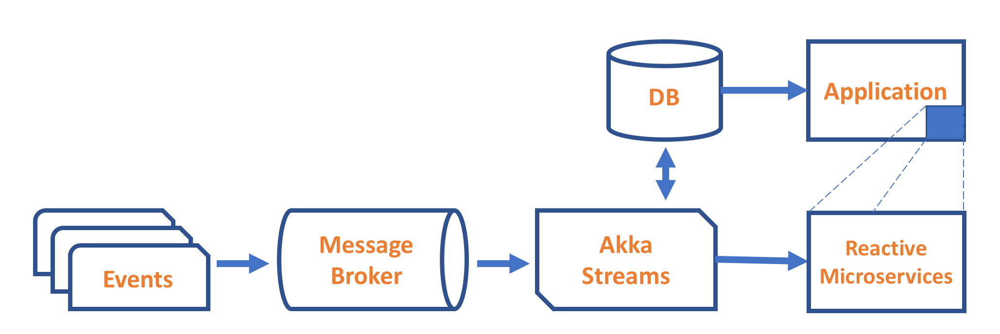
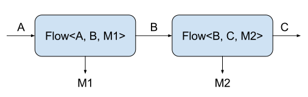

# Introduction to JDBC Streaming for Java Developers

With Microservices gaining a lot more traction in recent years, traditional enterprises running large, monolithic Java EE applications have been forced to rethink what they’ve been doing for nearly two decades. The need to modernise existing applications combined with new business requirements ultimately leads to changing technology stacks. Especially the hunt for high throughput and low resource consumption makes Reactive applications and Fast Data solutions extreme attractive. Instead of a greenfield development, most companies will work their steps towards these new challenges in risk free, smaller steps. A key to success with this approach is to find the suitable integration scenarios that support and protect both worlds. This is the first recipe in a series looking at Alpakka connectors and example integrations.

## Introduction
Before diving into the code example, a little bit of background on the relevance of streaming and interaction with existing applications will help with identifying the overall architectural use-cases.

### Streams in a monolithic world
Classical Big Data solutions have a couple of components. Ingesting events through a message broker, processing them in some kind of engine and storing them in a database or distributed filesystem. Monolithic applications can access the crunched data in the format that is needed. While these kind of architectures have many names (Data Warehousing, Analytics, etc) and come in a variety of styles (Hadoop, MapReduce, ETL, etc) they have one thing in common which is that they process workloads in batches.

<figure>
    
    <figcaption><strong>Figure 1.</strong>Classical messaging solutions</figcaption>
</figure>

This approach worked just fine until a couple of years ago. With the growing amount of data coming in from even more connected devices, the incremental updates or hourly batch runs are no longer sufficient enough to give a competitive advantage or even worse, won't allow the implementation of new business models. For example problems that are more
obviously “real time,” like detecting fraudulent financial activity as it happens can only be solved with low latency stream processing. However, streaming imposes new challenges that go far beyond just making batch systems run faster or more frequently. Streaming introduces new semantics for analytics. It also raises new operational challenges.
A complete reference architecture for Fast Data can be seen in the free O'Reilly Report by Dean Wampler: [Fast Data Architectures For Streaming Applications](https://info.lightbend.com/COLL-20XX-Fast-Data-Architectures-for-Streaming-Apps_LP.html).

The implications of these new architectures for classical monoliths are dramatic. Even if some platforms support asynchronous processing via REST or bidirectional streaming communication with e.g. WebSockets the majority of centralised systems is based on a blocking and synchronous server model (eg. Java EE). To modernise these systems in order to stay competitive the strangler pattern is an often used approach.

<figure>
    
    <figcaption><strong>Figure 2.</strong> Strangler Architecture with Streams</figcaption>
</figure>

Mixing fast and slow producers and consumers is the biggest challenge here. And just increasing buffer sizes until some hardware limit is reached, eg. memory isn't a solution. This is where backpressure comes into play. It helps to avoid unbounded buffering across asynchronous boundaries. You can learn more about [Akka Streams, backpressure and asynchronous architectures](https://www.lightbend.com/blog/understanding-akka-streams-back-pressure-and-asynchronous-architectures) in a talk by Konrad Malawski.
Also, looking at the database and the JDBC specification it quickly becomes clear, that most databases don't support  non-blocking, asynchronous calls. Introducing blocking code in a stream based solution won't work.

### Slick for JDBC to the rescue
[Slick](http://slick.lightbend.com/) is easy to use in asynchronous, non-blocking application designs, and supports building applications according to the [Reactive Manifesto](http://www.reactivemanifesto.org/). Unlike simple wrappers around traditional, blocking database APIs, Slick gives you:
* Clean separation of I/O and CPU-intensive code: Isolating I/O allows you to keep your main thread pool busy with CPU-intensive parts of the application while waiting for I/O in the background.
* Resilience under load: When a database cannot keep up with the load of your application, Slick will not create more and more threads (thus making the situation worse) or lock out all kinds of I/O. Back-pressure is controlled efficiently through a queue (of configurable size) for database I/O actions, allowing a certain number of requests to build up with very little resource usage and failing immediately once this limit has been reached.
* Reactive Streams for asynchronous streaming.
* Efficient utilization of database resources: Slick can be tuned easily and precisely for the parallelism (number of concurrent active jobs) and resource ussage (number of currently suspended database sessions) of your database server.
But instead of using Slick directly, we want to take a closer look at Akka Streams and Alpakka first.

### What is Akka Streams?
The purpose is to offer an intuitive and safe way to formulate stream processing setups such that can then be executed  efficiently and with bounded resource usage. That means there are no more OutOfMemoryErrors. In order to achieve this  streams need to be able to limit the buffering that they employ, they also need to be able to slow down producers if the consumers cannot keep up. This feature is called back-pressure and is at the core of the Reactive Streams initiative of which Akka is a founding member. You can learn more in the article [Reactive Streams for Java Developers](https://developer.lightbend.com/blog/2017-08-18-introduction-to-reactive-streams-for-java-developers/index.html). This means that the hard problem of propagating and reacting to back-pressure has been incorporated in the design of Akka Streams already, so you have one less thing to worry about; it also means that Akka Streams interoperate seamlessly with all other Reactive Streams implementations

### Akka Streams basics
In Akka Streams, the processing pipeline (the graph) consists of three types of elements: a `Source` (the producer), a `Sink` (the consumer), and `Flow`s (the processing stages).

Using those components, you define your graph, which is nothing more than a recipe for processing your data - it doesn't do any computations so far. To actually execute the pipeline, you need to materialize the graph, i.e. convert it to a runnable form. In order to do it, you need a so-called materializer, which optimizes the graph definition and actually runs it. Therefore, the definition of the graph is completely decoupled from the way of running it, which, in theory, lets you use any materializer to run the pipeline. However, the built-in `ActorMaterializer` is actually the status quo, so chances are you won't be using any other implementation.

When you look carefully at the type parameters of the components, you will notice that each of them, apart from the respective input/output types, has a mysterious `Mat` type. It refers to the so-called materialized value, which is a value that is accessible from outside the graph (as opposed to the input/output types which are internal to the communication between the graph stages - see Fig. 3). If you want to ignore the materialized value, which is quite often the case when you just focus on passing data between the graph stages, there is a special type parameter to denote it: `NotUsed`. You can think of it as being similar to Java's `Void`; however, it carries a little bit more semantic meaning - "we're not using this value" means more than just `Void`. Note also that in some APIs a similar type `Done` is used, to signal that something has completed. Other Java libraries would have perhaps used `Void` for both these cases, but Akka Streams attempts to keep all the types as semantically useful as possible.

<figure>
    
    <figcaption><strong>Figure 3.</strong> Flow type parameters explained</figcaption>
</figure>

### Relationship with Reactive Streams
The Akka Streams API is completely decoupled from the Reactive Streams interfaces. While Akka Streams focus on the formulation of transformations on data streams the scope of Reactive Streams is just to define a common mechanism of how to move data across an asynchronous boundary without losses, buffering or resource exhaustion.

The relationship between these two is that the Akka Streams API is geared towards end-users while the Akka Streams implementation uses the Reactive Streams interfaces internally to pass data between the different processing stages. For this reason you will not find any resemblance between the Reactive Streams interfaces and the Akka Streams API. This is in line with the expectations of the Reactive Streams project, whose primary purpose is to define interfaces such that different streaming implementation can interoperate; it is not the purpose of Reactive Streams to describe an end-user API.


### What is Alpakka?
[Alpakka](https://developer.lightbend.com/docs/alpakka/current/) is an initiative, which harbours various [Akka Streams](https://doc.akka.io/docs/akka/current/stream/index.html?language=java) connectors, integration patterns, and data transformations for integration use cases. Akka Streams already has a lot of functionality that is useful for integrations. The Akka Streams DSL is able to define processing pipelines which are needed for operations on streaming data that don't fit in memory as a whole. It handles backpressure in an efficient non-blocking way that prevents out-of-memory errors, which is a typical problem when using unbounded buffering with producers that are faster than consumers. But instead of implementing everything low-level yourself, Alpakka has a growing number of [existing connectors](https://developer.lightbend.com/docs/alpakka/current/connectors.html) that can be used out of the box.

Finally, the [Alpakka Slick (JDBC)](https://developer.lightbend.com/docs/alpakka/current/slick.html) connector brings all these technologies together and helps you build highly resilient integrations between your applications and various relational databases such as DB2, Oracle, SQL Server etc.

## The Example


### Architectural Overview
The example is using several tools from the Akka ecosystem (see Fig. 3). The core is Akka Streams, which lets us process the data in real time and in a streaming fashion. Reading and writing to the database is done via the Alpakka connector. Akka HTTP is used to expose both a WebSocket endpoint and a simple HTTP GET endpoint.

<figure>
    
    <figcaption><strong>Figure 4.</strong> Architectural Overview</figcaption>
</figure>

The database in this example is H2. Main reason for this is, that it is super easy to setup and configure in a Maven build. You can of course use any of the [Slick supported databases](http://slick.lightbend.com/doc/3.2.1/supported-databases.html). If you compare the above to a classical Java EE architecture, you’ll probably notice that things are much simpler here. No containers, no beans, just a simple standalone application. Moreover, the Java EE stack does not support the streaming approach whatsoever.

### Project Dependencies
You can find the dependencies in the project [pom.xml#L9](https://github.com/myfear/alpakka-jdbc/blob/master/pom.xml#L9)
The main dependencies of this project are `akka-stream-${scala.version}`, `akka-stream-alpakka-slick-${scala.version}` and `akka-http-${scala.version}`. Don't worry about the Scala version. as part of the `artifactId` it identifies binary compatibility with specific Scala versions. Remember: We love Scala and Java. To make it easier, it is captured in a Maven property: `<scala.version>2.12</scala.version>`
You also need to add the JDBC driver(s) for the specific relational database(s) to your project. In this case, it is `com.h2database.h2`.

### Preparation (DB and execution)
The h2 database needs initial setup and a clean start state. Instead of working with integration tests and a complex setup, it is easier to use the `sql-maven-plugin`. Use [this plugin](http://www.mojohaus.org/sql-maven-plugin/) to execute SQL statements in a combination of strings, a list of files and/or a set of files through sqlCommand, srcFiles, and fileset configurations respectively. In the plugin configuration  [pom.xmlL59](https://github.com/myfear/alpakka-jdbc/blob/master/pom.xml#L59) both the database location and the setup scripts are configured.
The `exec-maven-plugin` configures the convenient [pom.xml#L43](https://github.com/myfear/alpakka-jdbc/blob/master/pom.xml#L43) start with the `exec:java` goal.

### Run the example
Let's get things started:
```
mvn exec:java
```

### Try it out
Navigate to `http://localhost:8080/`and see a list of User objects being streamed
from the database via a WebSocket connection to the browsers `<textarea>`.

Navigate to `http://localhost:8080/more` and populate another 50 users to the database.
Refresh `http://localhost:8080/` and see the updated list.

### The DBProcessor
As you might have guessed, everything starts with the [`DBProcessor`](https://github.com/myfear/alpakka-jdbc/blob/master/src/main/java/com/example/alpakka/jdbc/DBProcessor.java#L26) class. Before anything else happens we will need an `ActorSystem` and a `Materializer`. With Akka Streams being build on top of Akka, the `ActorSystem` is what it's name implies: The main system that is running our components here. As a heavyweight object, there is only one per application. The `Materializer` is a factory for stream execution engines, it is the thing that makes streams run—you don’t need to worry about any of the details just now apart from that you need one for calling any of the run methods on a Source.
Before we look at the Sinks and Sources, there is one other important thing we need. The 'SlickSession', which is a thin wrapper around Slick’s database connection management and database profile API. We get one for a specific `slick-h2`config [DBProcessor.java#L37](https://github.com/myfear/alpakka-jdbc/blob/master/src/main/java/com/example/alpakka/jdbc/DBProcessor.java#L37). It is defined in the [resources/application.conf](https://github.com/myfear/alpakka-jdbc/blob/master/src/main/resources/application.conf) and contains nothing you wouldn't have expected from a JDBC connection definition. You can specify multiple different database configurations, as long as you use unique names. These can then be loaded by fully qualified configuration name using the `SlickSession.forConfig()` method described above. Slick requires you to eventually close your database session to free up connection pool resources. This is done on termination of the `ActorSystem`:

```Java
system.registerOnTermination(() -> {
          SESSION.close();
      });
```

The Slick connector allows you to perform a SQL query and expose the resulting stream of results as an Akka Streams `Source[T]`. Where `T` is any type that can be constructed using a database row. In our example we're going to stream [`User`](https://github.com/myfear/alpakka-jdbc/blob/master/src/main/java/com/example/alpakka/jdbc/User.java) objects to an Akka HTTP WebSocket endpoint. The Source definition looks like this:

```Java
final static Source<User, NotUsed> usersStream = Slick.source(
           SESSION,
           "SELECT ID, NAME FROM USERS ORDER BY ID",
           (SlickRow row) -> new User(row.nextInt(), row.nextString())
   );
```

But before we can select anything from a database, it needs to be there. To have both examples in one demo, the `DBProcessor` inserts the first 49 users before even starting the Akka HTTP server. The users stream is generated with  `Random().ints()` [DBProcessor.java#L40](https://github.com/myfear/alpakka-jdbc/blob/master/src/main/java/com/example/alpakka/jdbc/DBProcessor.java#L40) and returned as a `List<User>`. The Sink is responsible for the insert:

```Java
  private static final Function<User, String> insertUser = (user) -> "INSERT INTO USERS VALUES (" + user.id + ", '" + user.name + "')";
  final static Sink<User, CompletionStage<Done>> usersInsert = Slick.sink(SESSION, 4, insertUser);

```


## Further Reading
[Integration Pattern](https://developer.lightbend.com/docs/alpakka/current/patterns.html)
